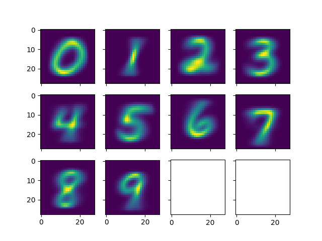

# MNIST
Measuring the accuracy of a trivial approach to the MNIST digits classification problem

While studying neural networks and the MNIST dataset, I wondered why this had to be so complicated.

(back-propagation, loss function, gradient descent, non-linear functions, number of neurons and layers, ...)

I wanted to check what accuracy a naive approach would have.

This code classifies the digits from the MNIST dataset by creating 10 "average" images of all digits.

Then, it compares new candidates with the 10 average images and picks the closest as the prediction.

The accuracy is only 80%, much lower than a well configured neural network, where you can expect ca. 98%.

However, this code is very short and doesn't depend on numpy, scipy, keras or tensorflow.

Additionaly, it is relatively fast, running in 14 seconds on my MacBook Pro.

Among other trivial approaches, my kids proposed comparing each test image with all training images.

I also wonder what the accuracy would be in this case, even if this approach doesnt's scale.

Reference: [http://yann.lecun.com/exdb/mnist/](http://yann.lecun.com/exdb/mnist/)

```
% python3 mnist.py
-- read_training_data()
............
-- draw_average_images()
-- read_test_images()
    index: 1000, accuracy: 0.774226
    index: 2000, accuracy: 0.758621
    index: 3000, accuracy: 0.767411
    index: 4000, accuracy: 0.764559
    index: 5000, accuracy: 0.762048
    index: 6000, accuracy: 0.778370
    index: 7000, accuracy: 0.788887
    index: 8000, accuracy: 0.795526
    index: 9000, accuracy: 0.807688
-- final accuracy: 0.808700
```


